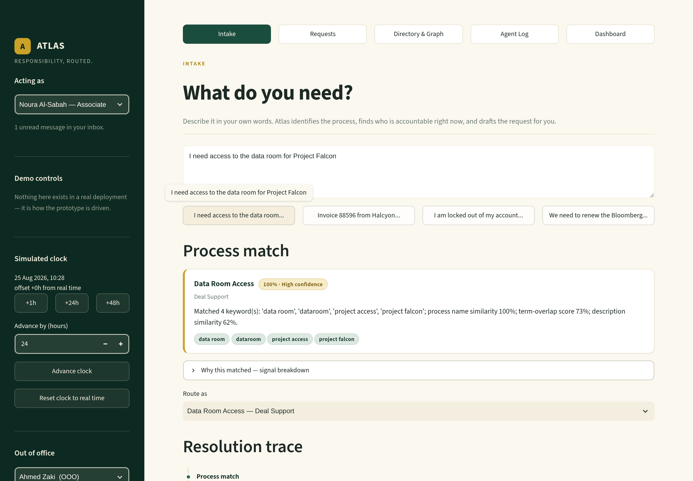
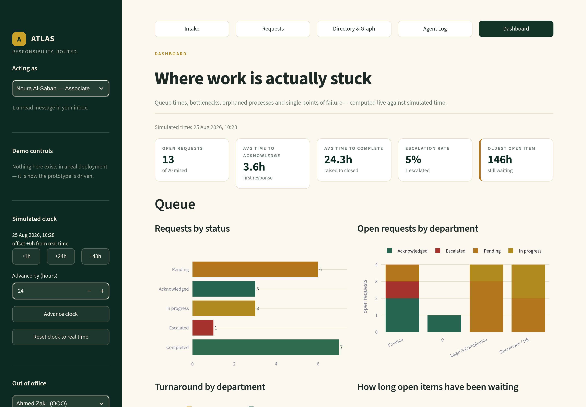
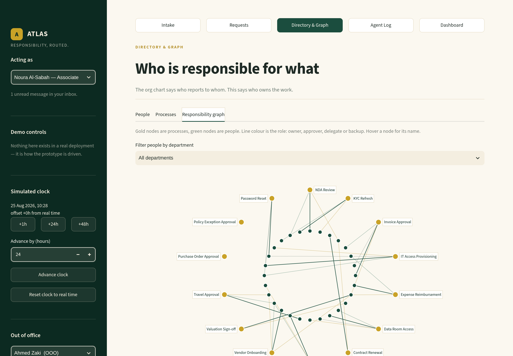

# Atlas

**An internal responsibility & request-routing platform.**

Every firm knows who reports to whom. Almost none can answer *"who is responsible
for X, right now?"* — not who owns it on paper, but who can actually action it
today, given that the owner is in Geneva until Thursday.

Atlas makes responsibility a live, queryable dataset and routes work through it.

This is a fully working local prototype: real SQLite database, real routing
logic, a real background agent, real analytics. The only thing that is fake is
the data — the 40 employees, 5 departments and 14 processes are seeded. There
are no integrations, no auth, and no network calls of any kind.



---

## Run it

```bash
cd atlas
pip install -r requirements.txt
python run.py
```

That single command creates the database if it is missing, seeds it, and opens
the app at <http://localhost:8501>.

Useful flags:

| Command | What it does |
| --- | --- |
| `python run.py` | Seed if needed, then launch |
| `python run.py --reseed` | Wipe and reseed first (a clean slate before a demo) |
| `python run.py --seed-only` | Build the database and exit |
| `python run.py --port 8600` | Run on a different port |
| `python verify.py` | Run the acceptance checks headlessly and reseed |

Requires Python 3.10+. Everything runs offline.

To put it on a URL someone else can open, see **[DEPLOY.md](DEPLOY.md)** —
Streamlit Community Cloud takes about two minutes, and there is a `Dockerfile`
for any container host.

---

## The three-minute demo

Run `python run.py --reseed` first so the clock starts at zero.

**0:00 — The problem (Dashboard, 20s).**
Open **Dashboard**. Two processes have no owner at all — *Purchase Order
Approval* and *Policy Exception Approval*. Requests matched to them have
nowhere to go. Further down, **Huda Al-Najjar** owns or approves four
processes, and *Valuation Sign-off* has no delegate or backup behind her. She
is currently out of office. That is a firm-wide single point of failure that no
org chart would ever show you.

**0:20 — Intake (50s).**
Go to **Intake**. You are acting as *Noura Al-Sabah* (sidebar). Click the first
example, or type:

> I need access to the data room for Project Falcon

Atlas matches **Data Room Access** at 100% confidence and shows exactly why —
the keywords it hit, the name similarity, the term-overlap score. Then read the
**resolution trace** aloud:

1. Owner lookup → *Layla Mansour* owns this process.
2. Availability check → **she is out of office** until 31 August.
3. Delegate lookup → *James Okonkwo* is the configured delegate and is available.

The request is drafted for James, with a line explaining why he is receiving it.
Press **Send request**. The timeline shows every routing decision that was made.

**1:10 — Nothing dead-ends (40s).**
Switch the sidebar user to **James Okonkwo**. The request is in his inbox as
*Pending*. Now switch back and click **+48h** in the sidebar.

Open **Agent Log**. The agent — which has been evaluating its rules against
simulated time the whole session — has sent a chase: *"No acknowledgement after
48h — chase 1 of 2 sent to James Okonkwo."* Nobody clicked anything to make
that happen.

Click **+24h** twice more. Chase 2 goes out, then the agent hands the request
to *Omar Haddad*, the configured backup. Two more advances and it escalates to
*Faisal Al-Otaibi* — James's manager — and the requester is notified. Every one
of those actions appears in both the Agent Log and the request's own timeline,
each with its reason.

**2:00 — Closing the loop (35s).**
Switch to whoever currently holds the request, open it from **Requests**, and
press **Acknowledge** then **Complete**. Now switch back to *Noura Al-Sabah* —
the request stays open in front of you, seen from her side this time, carrying
the full audit trail from intake to completion.

**2:35 — The out-of-office failover, live (25s).**
In the sidebar, mark any assignee with an open request **out of office**. The
agent reroutes their live work to a delegate within a couple of seconds and
writes an explanatory note to both sides. Return to the **Dashboard** — the
bottleneck table, escalation rate and single-point-of-failure report have all
moved.

---

## Screenshots

| | |
| --- | --- |
|  |  |
| The dashboard: queue health, orphans and single points of failure | The responsibility graph: people, processes and the edges between them |

---

## How it works

### The responsibility graph

People and processes are nodes; `responsibilities` are the edges, each carrying
a role — `owner`, `approver`, `delegate` or `backup`. Resolution walks that
graph:

```
process → owner → out of office? → delegate → backup → manager → flag for admin
```

Nothing dead-ends. If every hop fails, the request is parked for an admin with
the reason recorded, rather than silently dropped. **Directory & Graph** shows
the whole thing, including a network view of every edge.

### The simulated clock

This is what makes the demo possible. A time offset lives in `settings`, and
**every** timestamp Atlas reads or writes goes through `atlas/clock.py::now()`.
Business logic never calls `datetime.now()` itself.

The sidebar advances the offset by +1h / +24h / +48h (or any custom amount).
Because the agent evaluates its rules against simulated time, chase and
escalation behaviour that would take days in production genuinely executes in
seconds — it is the same code path, not a shortcut.

### The agent

A daemon thread wakes every two seconds and applies four rules:

| Rule | Trigger | Action |
| --- | --- | --- |
| R1 | A request is sent | Dispatch to the assignee, log the event |
| R2 | Pending and unacknowledged for 48 simulated hours | Chase the assignee (max 2 chases, 24h apart) |
| R3 | Two chases, still no response | Hand over to whoever covers the assignee; if nobody does, escalate to their manager. The requester is notified either way |
| R4 | The assignee is marked out of office | Reroute immediately to their delegate with an explanatory note |

Every autonomous action writes an `Event` (which powers both the Agent Log and
the request timeline) and a `Message` (which lands in someone's inbox).

### Intent matching

Offline only — no model downloads, no API calls. Four signals are blended:
exact and fuzzy keyword hits (rapidfuzz), fuzzy similarity against the process
name, a hand-rolled TF-IDF cosine over the process corpus, and description
similarity. The Intake page shows the breakdown, so a match is always
explainable.

If a similar open request already exists on the same process, Atlas says so and
offers to follow it rather than adding a duplicate to the queue.

---

## Layout

```
atlas/
├── run.py              # one command: create, seed, launch
├── verify.py           # headless acceptance checks
├── app.py              # Streamlit entry point + navigation
├── requirements.txt
├── atlas/
│   ├── config.py       # paths, agent thresholds, palette
│   ├── models.py       # SQLAlchemy schema
│   ├── db.py           # engine, sessions, settings helpers
│   ├── clock.py        # the simulated clock — the only wall-clock read
│   ├── seed.py         # the demo firm
│   ├── matching.py     # offline intent matching
│   ├── routing.py      # responsibility resolution + trace
│   ├── services.py     # request lifecycle
│   ├── agent.py        # the background agent and its rules
│   ├── analytics.py    # queue, bottleneck, orphan and SPOF metrics
│   └── ui/             # theme, shared components, sidebar
├── views/              # Intake, Requests, Directory, Agent Log, Dashboard
└── data/atlas.db       # created on first run (gitignored)
```

### Schema

`departments`, `people`, `processes`, `responsibilities`, `requests`,
`messages`, `events`, `settings`. `events` is the full audit trail; `settings`
holds the clock offset and the agent thresholds, so the 48h/24h/max-2 rules can
be retuned without touching code.

---

## Seeded demo conditions

These are deliberate — they are what the walkthrough depends on.

- **4 people out of office** with return dates, including *Layla Mansour*, who
  owns Data Room Access and has a configured delegate.
- **2 orphan processes** with no owner: Purchase Order Approval, Policy
  Exception Approval.
- **1 single point of failure**: *Huda Al-Najjar* owns or approves four
  processes, and Valuation Sign-off has no cover behind her.
- **20 historical requests** in mixed states, two of them already past the
  48-hour chase threshold, so the Agent Log has content the moment you open it.

Reset any time from the sidebar (**Reset & reseed**) or with
`python run.py --reseed`.

---

## Notes

- No network access at runtime. No webfonts, no CDNs, no telemetry — `verify.py`
  asserts that no outbound socket is opened.
- SQLite runs in WAL mode with a shared write lock, so the agent thread and the
  UI never collide.
- Repeated clicks, empty inboxes and empty charts are all handled; the app is
  built to survive a live demo.
